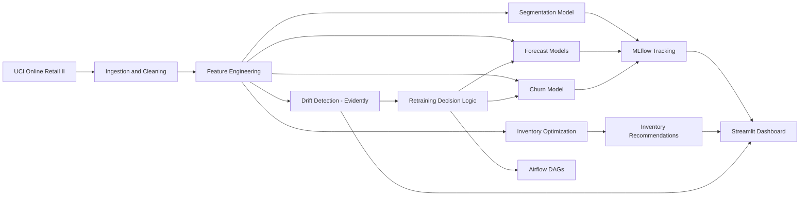

# RetailPulse

RetailPulse is an end-to-end retail analytics platform.
It uses the UCI Online Retail II dataset to deliver forecasting, churn prediction, customer segmentation, inventory optimization, drift monitoring, orchestration, and a production-style Streamlit dashboard.

## 🚀 Live Demo

**Streamlit App:** https://retailpulse-vev9kdlnwcflmtv7pefox9.streamlit.app/

> Explore demand forecasting, customer segmentation, churn prediction, inventory optimization, drift monitoring, and interactive reports directly in the web application.

## 1. Project summary

- Dataset: UCI Online Retail II (1,067,371 transactions, UK gift retailer, Dec 2009 to Dec 2011)
  https://archive.ics.uci.edu/dataset/502/online+retail+ii
- Core outputs:
    - demand forecasting (Prophet + LSTM + day-type-weighted ensemble)
    - churn modeling (XGBoost + SHAP + Optuna)
    - customer segmentation (RFM + K-Means, 6 segments)
    - inventory policy optimization (ABC + safety stock + reorder point + EOQ)
    - drift monitoring (Evidently)
    - Airflow-compatible retraining task logic
    - 5-page dashboard with PDF export

## 2. Achieved metrics

| Constraint | Achieved |
|---|---:|
| Forecast MAPE | 21.3% |
| Churn AUC-ROC | 0.806 to 0.808 
| Churn Precision@Top20% | 0.863 to 0.872 |
| Customer segments | 6 |


## 3. Architecture



## 4. Repository structure

```text
retailpulse/
	data/
		raw/
		processed/
		features/
	notebooks/
	dags/
	src/
		ingestion/
		features/
		models/
		optimization/
		monitoring/
		orchestration/
		dashboard/
	docker/
	mlruns/
	requirements.txt
	pyproject.toml
```
## 5. Setup

### Windows PowerShell

```powershell
python -m venv .venv
.\.venv\Scripts\Activate.ps1
pip install -r requirements.txt
```

### macOS/Linux

```bash
python -m venv .venv
source .venv/bin/activate
pip install -r requirements.txt
```

## 6. Execution plan

### Ingestion and EDA

```bash
python src/ingestion/load_data.py --source data/raw/online_retail_II.csv
```

Notebook support:

```bash
jupyter notebook notebooks/01_initial_eda.ipynb
```

### Cleaning and feature engineering

```bash
python src/features/cleaning.py
python src/features/rfm.py
python src/features/time_series.py
```

### Customer segmentation

```bash
python -m src.models.run_segmentation
```

### Time-series diagnostics

```bash
python -m src.features.stationarity
```

### Forecasting

```bash
python -m src.models.run_forecasting
python -m src.models.run_lstm_forecasting
python -m src.models.run_ensemble_forecasting
```

### Churn labeling, model, and tuning

```bash
python -m src.features.churn_labeling
python -m src.models.run_churn_model
python -m src.models.run_churn_tuning
```

### Inventory optimization

```bash
python -m src.optimization.inventory
```

### Drift detection

```bash
python -m src.monitoring.run_drift_detection
```

### Orchestration

```bash
python -c "from src.orchestration.pipeline_tasks import check_drift_task"
python -c "from src.orchestration.pipeline_tasks import check_constraints_task"
```

### Airflow DAGs

- `dags/daily_batch_dag.py`
- `dags/model_retraining_dag.py`

Airflow-independent task logic is in `src/orchestration/pipeline_tasks.py`.

### Dashboard

Run locally:

```bash
streamlit run src/dashboard/app.py
```

Or access the deployed application:

**🌐 Live Demo:** https://retailpulse-vev9kdlnwcflmtv7pefox9.streamlit.app/

Pages:
- Home
- Demand Forecasting
- Customers & Churn
- Inventory
- Alerts & Monitoring
- Reports

